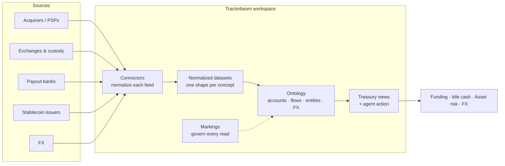
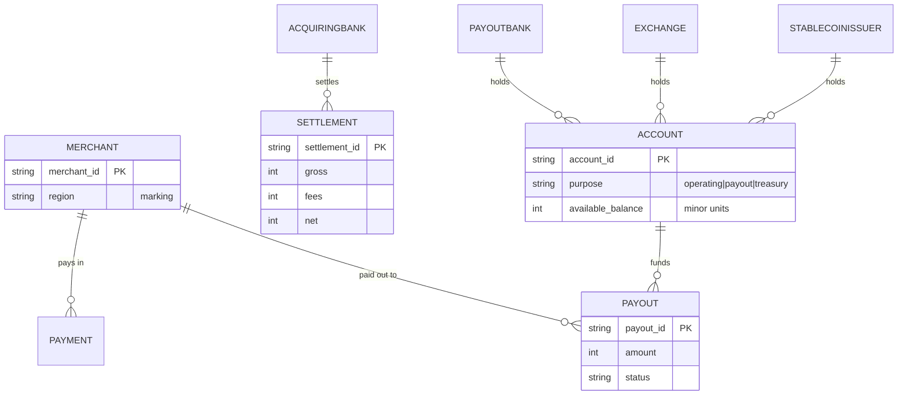
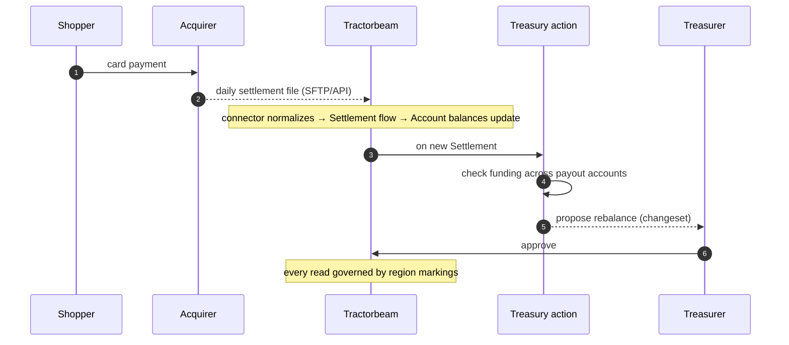

# `tokenstream` — a Tractorbeam example workspace

`tokenstream` models a representative stablecoin-payments stack as a Tractorbeam workspace.
Card and bank pay-ins settle through acquirers, fiat converts to stablecoin via exchanges and
issuers, payouts move through sponsor banks, and FX quotes roll in continuously. Every source
lands as a connector emitting one of a few shared row shapes; the ontology composes those rows
into the entities a treasury team reasons about — accounts, payments, settlements, payouts, FX
— and a `region` marking travels with the data so access is governed on every read.

The workspace materializes end to end on **synthetic data with no credentials**: every
connector mocks its network send (`connectors/_transport.py`) but builds real auth headers
against any mounted secret, so the production path is a one-line swap.

## Architecture



Four pieces, each load-bearing:

- A connector per source pulls its feed on its native cadence and maps it to one shared row shape.
- An ontology models counterparties, the accounts that hold balances, the payments / settlements / payouts that move value, and FX.
- Markings travel with the data, so a region restriction enforces on every read.
- A treasury action flags a payout account that won't cover its next cycle and proposes a rebalance as a changeset a human approves.

## Data model



The model splits into stocks, flows, and reference. Stocks are balances held: `Account`
(operating, payout, or treasury), plus the fiat and stablecoin balances on `Exchange`. Flows
are value moved: `Payment` in, `Settlement` from the acquirer, `Payout` out. Reference is
`FXPair`. Governance rides on `region`, a grouped marking: `Account` and `Merchant` carry it
directly, while `Payment` and `Payout` inherit it from the merchant via
`tb.Marking("region", through="merchant")`, so access control follows the money.

## Modules

| Path | Declares |
|------|----------|
| `connectors/` | Source feeds, one module per source: acquirers (`jpmorgan`, `adyen`, `worldpay`, `fiserv`), exchanges and custody (`coinbase_prime`, `kraken`, `gemini`, `fireblocks`), payout banks (`column`, `cross_river`, `increase`), issuers (`circle`, `paxos`), FX (`oanda`), and Tokenstream's own analytical warehouse (`clickhouse`). `_transport.py` is the mocked network boundary, `_auth.py` holds the auth patterns, `_schemas.py` holds the shared normalized shapes. |
| `entities.py` | Counterparties: `AcquiringBank`, `PayoutBank`, `Exchange`, `StablecoinIssuer`, and `Merchant`. |
| `stocks.py` | `Account`, the balances held (the stocks), linked to the counterparty that holds them. |
| `flows.py` | `Payment`, `Settlement`, `Payout`, the value moved (the flows). |
| `reference.py` | `FXPair`, the closeout rates. |
| `actions.py` | `flag_underfunded` (scheduled) and `propose_rebalance` (on each settlement). |
| `admin/markings.toml`, `admin/grants.toml` | The `region` marking registry and group grants. |

## Connectors and auth

Each connector builds an authenticated request and maps a provider-shaped response into the
shared row (`connectors/_schemas.py`). `_transport.py` mocks the network send so the workspace
runs offline; in production it swaps for a real HTTP or SFTP call with no change to the
surrounding code. The auth patterns are real, computed against the mounted secret:

| Pattern | Counterparties |
|---|---|
| Bearer token | Increase, Circle, OANDA |
| API-key header | Adyen |
| HTTP Basic | Column, ClickHouse |
| HMAC (SHA-256, SHA-384, SHA-512) | Coinbase Prime, Kraken, Gemini |
| OAuth2 client-credentials | Cross River, Paxos |
| RS256 JWT per request | Fireblocks |
| SSH-key SFTP and file parse | JPMorgan, Worldpay, Fiserv |

Each `@tb.output` declares its column schema and a cadence (daily settlement batches at
06:00–07:00, balance snapshots every 15 minutes, FX quotes every 5 minutes), then generates
synthetic sample data on that cadence, so a freshly applied workspace fills with data on
schedule.

## A day in the life



## Deploy

Install the SDK and authenticate, then preview and apply:

```bash
uv sync
tractorbeam auth login --platform-url <api-url> --workspace <workspace-slug>

tractorbeam diff  --branch main        --workspace tokenstream
tractorbeam apply --branch tokenstream --workspace tokenstream
```

The platform holds the provider secrets each connector references (`jpmorgan_sftp`,
`column_api_key`, `circle_api_key`, `clickhouse_credentials`, …) and injects them into the
workers at runtime. To check the workspace parses, compile it locally without a platform from
the repo root:

```bash
uv run python -m tractorbeam dump tokenstream > /dev/null
```

## Tests

`uv run python -m tractorbeam dump tokenstream` compiling cleanly is the local check. On the
platform, an applied workspace is pinned by a wire-parity snapshot, so any change to the
declarations surfaces as a reviewable diff.
